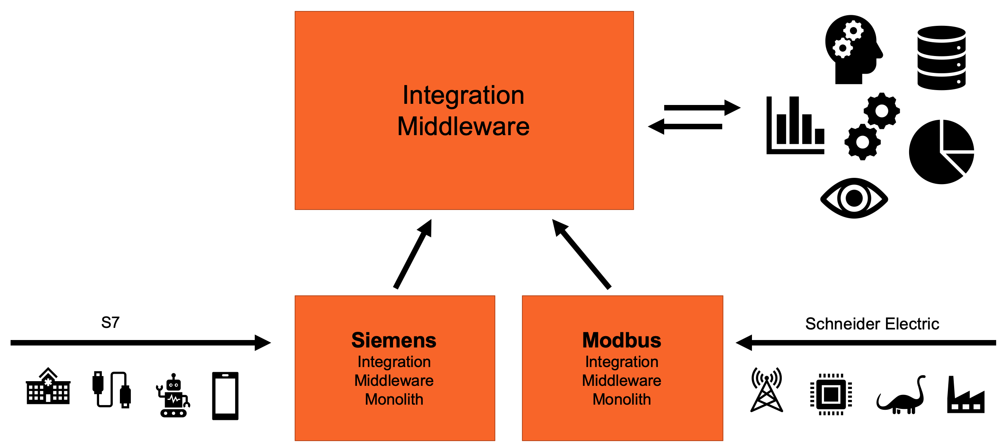
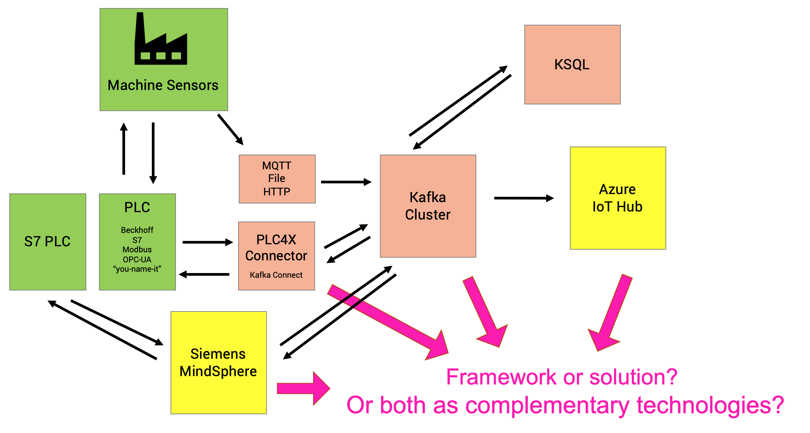

# Demo Under Construction !!! Target Date: October 2019

# Kafka-native end-to-end IIoT Data Integration and Processing with Kafka Connect, KSQL and Apache PLC4X

This project shows how to integrate, process and analyze data from Industrial IoT (IIoT) devices and machines in real time, reliable and scalable. We leverage Apache Kafka, Kafka Connect, KSQL and Apache PLC4X. 

## Use Cases in Industry 4.0 / IIoT - Big Data, Analytics, Real Time Processing

### Analytics

- Ingest data into cloud for analytics to a) reduce cost: Leverage open frameworks instead of paying very expensive licenses per machine and b) flexible integration (select data to ingest, flexible changes over time)
- Machine Learning / Data Science

### Manufacturing

- Collect data from machines  Preprocess + monitoring to optimize assembly line and reduce cost
- Aggregate data from different machines / companies —> Leverage (and sell?) insights
- Sell services on top of machines —> Predictive maintenance (remote)
- Scale up (add more sites, add more data)

### Production Robots
- Ingest, process and monitor large volumes data (where the proprietary monolith does not scale)

### Smart Factories
- Monitor and manage the whole factory (at scale, in real time, flexible)
- Integration with legacy proprietary protocols and modern cloud-native technologies

Unfortunately, there are some huge challenges to implement these IIoT use cases in the real world:

## Challenges in Industry 4.0 / IIoT

In short: *IoT != IIoT*:

- IoT == Connected cars, smart home, etc. Large scale, secure, scalable, open, modern technologies
- IIoT == Slow, unsecure, not scalable, proprietary

IIoT usually uses incompatible protocols, which typically are proprietary. Machines have a very long lifecycle (tens of years). Factories cost millions, no simple changes / upgrades possible.

Factories are built out of monoliths without scalability, extendibility, or real failover. Security is completely missing - there is no authentication or authorization. 

In real world, you typically see one of two sitations:

- A company does not have access to the valuable data of its machines and devices
- A proprietary, inflexible, monolithic, expensive IoT solution is bought and installed for each PLC technology like Siemens S7, Modbus, etc. (often combined with another "central general middleware solution")

As a side note: This project is not about the central integration middleware, but specifically about IIoT integration. If you need a better understanding of how to build a scalable, flexible and reliable middleware, check out [Event Streaming Platform vs. Traditional Middleware like MQ, ETL, ESB](http://www.kai-waehner.de/blog/2019/03/07/apache-kafka-middleware-mq-etl-esb-comparison/) for more details.

## Opportunities in Industry 4.0 / IIoT

Huge opportunities exist in IIoT and Industry 4.0, but you need to get rid of the old legacy architecture (while you need to keep the old machines and legacy protocols, unfortunately). 

Here is the key characteristics of the new architecture:

- Cost reduction
- Flexibility 
- Standards-based
- Scalability 
- Extendibility
- Security

How to get from legacy, proprietary to cloud, big data, machine learning to realize all these valuable use cases?

## Architecture

We demonstrate how to achieve all characteristics leveraging the following open source technologies:

- Apache Kafka: An Event Streaming platform to process huge volumes of data reliably in real time
- Kafka Connect: A general integration framework built on top of Kafka (and part of the same Apache project) to leverage all of its features under the hood to integrate with any source or sink
- Apache PLC4X: Integration framework dedicated to  integration with legacy proprietary IIoT protocols like Siemens S7, Modbus, Beckhoff ADS, Allen Bradley Ethernet, et al. 

This combination provides a scalable, flexible and secure infrastructure to build an integration between machines and devices on IoT side and the rest of the enterprise like big data analytics tools, ERP systems,cloud services or any other business application:

TODO Share Slide Deck and Video Recording

## Open Source vs. Commercial IoT Platform Solutions - Friends, Enemies, Frenemies?

Before we come to the live demo, here a few more thoughts:

- Open source solutions like Apache Kafka or PLC4X are open and flexible, but also battle-tested in many production deployments.
- Commercial IoT Platform Solutions like Siemens MindSphere, Cisco Kinetic or IoT solutions from cloud providers like GCP, AWS or Azure are proprietary, costly and inflexible (because you typically cannot easily adjust them - they are built for one specific infrastructure or IIoT product line)
- Commercial IoT Platform Solutions also have many pros like being a completely platform instead of a framework, and providing tooling like nice drag&drop user interfaces

Therefore, this is typically not an "either... nor" decision. In many scenarios, both options can be combined and are complementary. It is no surprise that most IoT Platform Solutions also provide a Kafka adapter to build a scalable streaming platform and integrate with the rest of the enterprise in a proven, battle-tested way leveraging open source components.

## Live Demo - Try it out yourself!

### Use Case

TODO Kai

### Requirements 

TODO Kai

### Scripts / Config / Code

- MVP: 1 PLC --> PLC4X --> Kafka Connect --> Kafka --> KSQL Consumer
- V2: 2 or more different PLC --> PLC4X --> Kafka Connect --> Kafka --> KSQL Consumer + Simple UI (whatever tool)

### Step-by-Step Guide

TODO Kai

